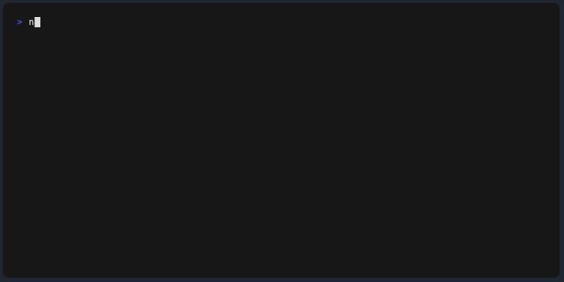

# npm-get-author-packages

[](#cli)
[](https://www.npmjs.com/package/npm-get-author-packages)
[](https://badge.fury.io/js/npm-get-author-packages)
[](https://www.npmjs.com/package/npm-get-author-packages)
[](https://packagephobia.com/result?p=npm-get-author-packages)
[](https://piecioshka.mit-license.org)

🔨 Display npm author packages with the creation date



> Give a ⭐️ if this project helped you!

## Features

- ✅ Show a list of all npm packages of the passed author with the creation date
- ✅ Add `[TS]` icon if package is written in TypeScript
- ✅ Add `[CLI]` icon if package support CLI
- ✅ Display package dependencies with `--with-dependencies` flag

## CLI

Installation:

```bash
npm install -g npm-get-author-packages
```

```bash
npm-get-author-packages <username> [--with-dependencies]
```

### Options

- `--with-dependencies` - Display the list of dependencies for each package

## Example

```bash
npm-get-author-packages piecioshka
```

```bash
Found 44 package(s):
# ...
- 2016-07-25 pokemon-picker v1.2.10  CLI
- 2016-10-26 encoding-checker v1.1.19  CLI
- 2016-11-18 github-track-followers v2.1.5  CLI
- 2017-01-16 less-compile-file v1.0.8
- 2017-04-28 create-ts-project v1.0.13  CLI
# ...
```

### With dependencies

```bash
npm-get-author-packages piecioshka --with-dependencies
```

```bash
Found 44 package(s):
# ...
- 2016-07-25 pokemon-picker v1.2.10  CLI  (deps: commander)
- 2016-10-26 encoding-checker v1.1.19  CLI  (deps: colors, glob, glob-promise, jschardet, yargs)
- 2016-11-18 github-track-followers v2.1.5  CLI  (deps: colors, commander, debug, superagent)
- 2017-01-16 less-compile-file v1.0.8 (deps: debug, fs-extra, glob, less)
- 2017-04-28 create-ts-project v1.0.13  CLI  (deps: replace-in-files, yargs)
# ...
```

## 🤝 Contributing

Contributions, issues and feature requests are welcome!<br />
Feel free to check [issues page](https://github.com/piecioshka/npm-get-author-packages/issues/).

## Related

- [npm-list-author-packages](https://github.com/kgryte/npm-list-author-packages) — A similar project but not maintained for the last 9 years
  - ⚠️ WARNING: not working anymore

## License

[The MIT License](https://piecioshka.mit-license.org) @ 2025
